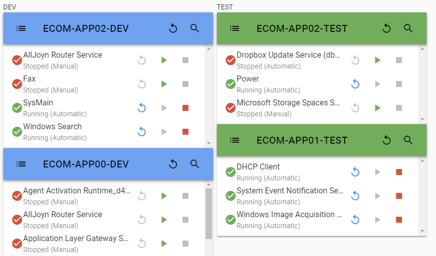

## PowerShell Service Manager
A GUI for managing windows selected services on multiple machines.

Configure your environments, servers and selected servers to view and manage (start/stop/restart) only those services you need.

